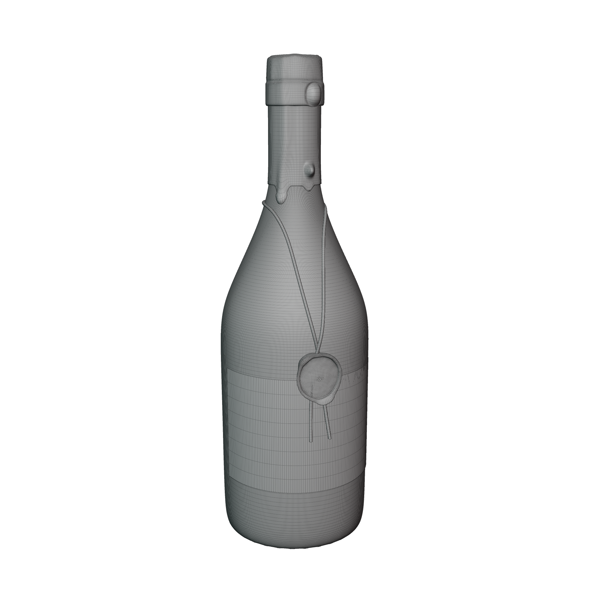

## Modeling Workshop Session

Today, we'll concentrate on creating more intricate forms by using techniques such as proportional editing for seamless feature transitions and applying modifiers for organic deformations. By the end of the session, we'll have our model ready to move on to the texturing phase. Ideally, our model will resemble something along these lines.

