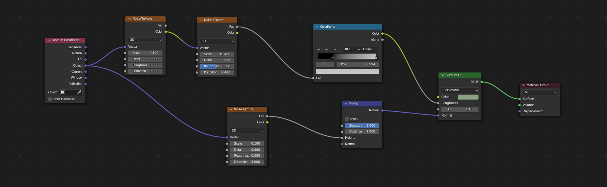

## Building Our Third Procedural Texture

We’ll create a glass-like procedural material.

1. **Adding a Glass Shader**  
   - **Shortcut Method:**  
     - <kbd>Shift+A</kbd> → `Shader > Glass BSDF`.  
   - **GUI Method:**  
     - `Add > Shader > Glass BSDF`.

2. **Adjusting IOR, Roughness**  
   - **Shortcut Method:**  
     - <kbd>Left-Click</kbd> on the value fields and type numeric values; or <kbd>Tab</kbd> between fields to edit.  
   - **GUI Method:**  
     - Click inside the IOR or Roughness fields in the node properties and move the mouse or type a value.
