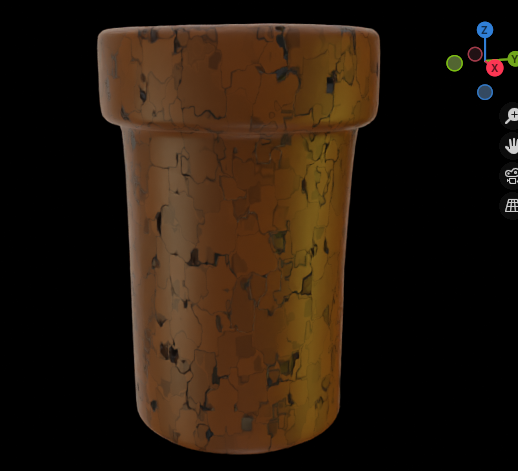
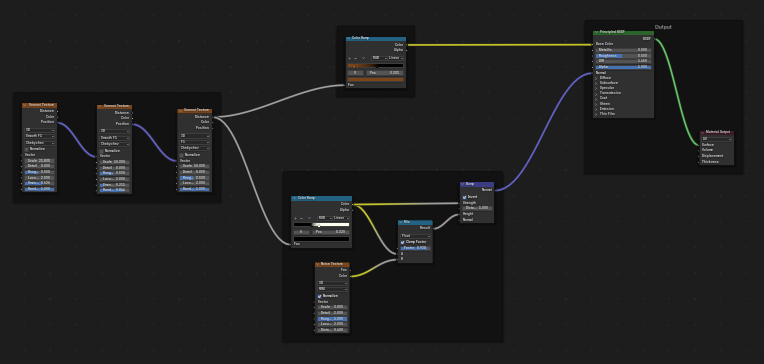
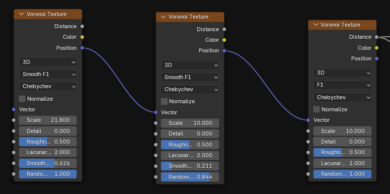
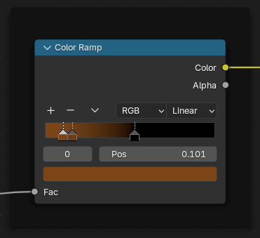
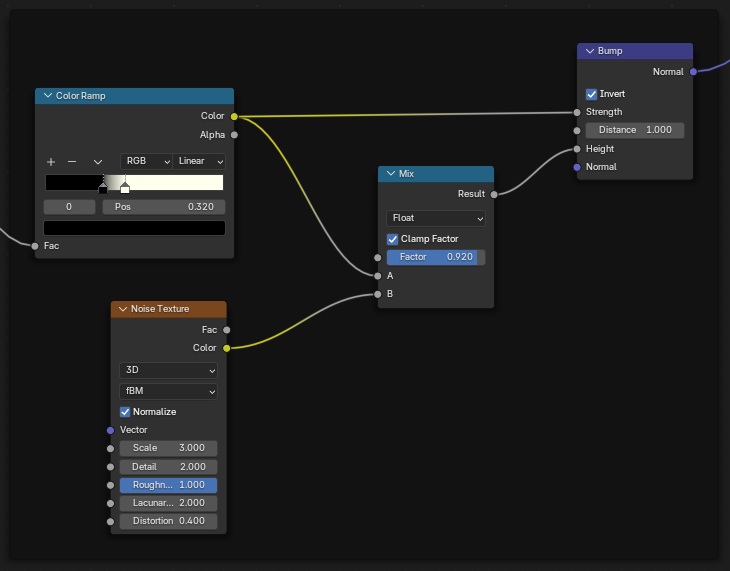
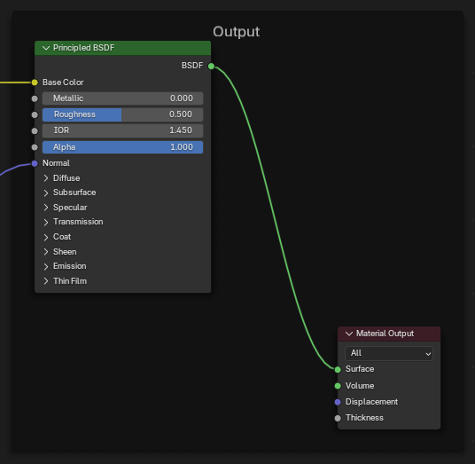

## Building Our Fifth and Final Procedural Texture

 
 ---
 
Follow the same pattern as above (add noise/textures/shaders). Experiment with combining multiple nodes.  
- **Shortcut Tips:**  
  - <kbd>Shift+D</kbd> duplicates any selected node.  
  - <kbd>Ctrl+Shift+Left-Click</kbd> (with Node Wrangler) previews outputs.  
- **GUI Method:**  
  - `Add > ...` as needed, or `Right-Click > Duplicate` on a node.
