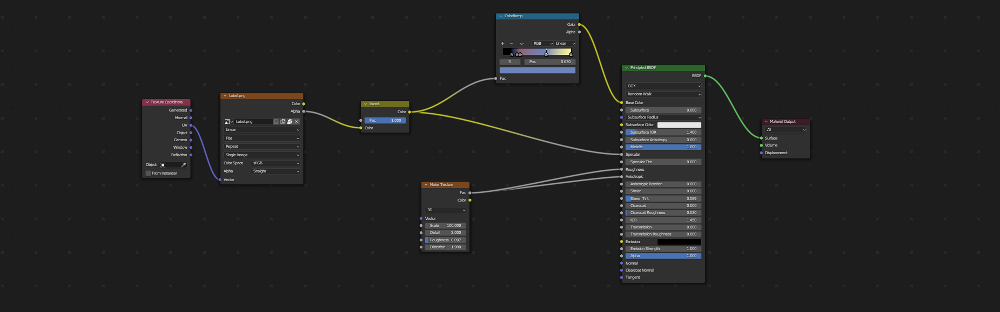

# Chapter 2 – Session #4

> **Note:** This session focuses on texturing methods, both procedural and mapped. We’ll highlight shortcut-based approaches first, followed by GUI-based methods.  
>  
> For a deeper look at procedural textures, see [Procedural texture](https://en.wikipedia.org/wiki/Procedural_texture). To learn about UV mapping, see [UV mapping](https://en.wikipedia.org/wiki/UV_mapping). For rendering details, check [3D rendering](https://en.wikipedia.org/wiki/Rendering_(computer_graphics).

---

## Texturing Workshop Session

We will create, customize, and apply procedural textures, then compare them to mapped (image-based) textures. Afterward, we’ll set up our scene and produce a final render.

---

## Comparing Procedural and Mapped Textures

### Procedurally Generated Textures
- Instant tweaks
- Can be animated
- Generally take up less space
- Can be tedious

### Mapped Textures (UV or Projected)
- Render efficiently
- Transport between applications
- Offer more control
- More widely used

---

## Setting up Our Workspace for Texturing

1. **Window Splits**  
   - **Shortcut Method:**  
     - Hover near a window boundary until a double arrow appears, then <kbd>Right-Click</kbd> → `Split Area` or drag from a corner to split.  
   - **GUI Method:**  
     - Move the mouse to the top-right corner of any editor, click and drag to split or merge.

2. **Changing Workspaces**  
   - **Shortcut Method:**  
     - Use <kbd>F3</kbd> and type `New Workspace` or click the `+` tab at the top to add a new workspace (e.g., `Shading`).  
   - **GUI Method:**  
     - Go to `Window > New Workspace` or click the `+` button in the workspace tabs and pick a workspace template (e.g., `Shading`, `Compositing`, etc.).

3. **Downloading Resource Files**  
   - No direct Blender shortcut.  
   - Use your web browser or file explorer to download needed resources.  
   - **GUI Note:**  
     - In Blender, you can open `File > External Data > Find Missing Files` if you need to relocate downloaded textures.

4. **Creating Blank Textures**  
   - **Shortcut Method (Shader Editor):**  
     - Switch to `Shader Editor` (<kbd>F3</kbd> and type `Shader Editor` or use the workspace tab).  
     - Press <kbd>Shift+A</kbd> → `Texture > Image Texture`, then click `New` to create a blank image.  
   - **GUI Method:**  
     - `Add > Texture > Image Texture` in the Shader Editor toolbar, then select `New` to define width/height/color.

---

## Building Our First Procedural Texture

We’ll create a procedural texture for the red dipped wax.

1. **Accessing the Shader Editor**  
   - **Shortcut Method:**  
     - Press <kbd>F3</kbd>, type `Shader Editor`, then press <kbd>Enter</kbd>.  
   - **GUI Method:**  
     - Change the editor type in any window corner to `Shader Editor`.

2. **Adding Nodes**  
   - **Shortcut Method:**  
     - <kbd>Shift+A</kbd> → `Shader > Principled BSDF`, or `Texture > Noise Texture`, etc.  
   - **GUI Method:**  
     - In the Shader Editor header, click `Add > Shader`, `Add > Texture`, and so on.

3. **Connecting Nodes**  
   - **Shortcut Method:**  
     - <kbd>Left-Click + Drag</kbd> from output sockets to input sockets.  
   - **GUI Method:**  
     - Same method using standard click and drag in the Shader Editor.

4. **Real-Time Preview**  
   - **Shortcut Method:**  
     - Make sure you’re in `Material Preview` or `Rendered` mode by pressing <kbd>Z</kbd> in the 3D viewport and choosing `Material Preview` or `Rendered`.  
   - **GUI Method:**  
     - In the 3D viewport header, select `Viewport Shading > Material Preview` or `Rendered`.

---

## Building Our Second Procedural Texture with a Mapped Texture

We’ll combine a procedural texture (e.g., for a label background) and a mapped image texture (the label design).

1. **Adding the Image Texture**  
   - **Shortcut Method:**  
     - <kbd>Shift+A</kbd> → `Texture > Image Texture`, then <kbd>Open</kbd> to locate your `.png` label.  
   - **GUI Method:**  
     - `Add > Texture > Image Texture`, then click `Open` to browse.

2. **UV Mapping**  
   - **Shortcut Method:**  
     - In `Edit Mode`, press <kbd>U</kbd> → `Unwrap` (or select a projection method).  
   - **GUI Method:**  
     - `Mesh > UV Unwrap > Unwrap` (in `Edit Mode`).

3. **Combining with Procedural Nodes**  
   - **Shortcut Method:**  
     - <kbd>Shift+A</kbd> to add Mix, ColorRamp, or other blending nodes. Connect the image texture with procedural nodes into the `Principled BSDF`.  
   - **GUI Method:**  
     - `Add > Color > MixRGB` (or similar). Then connect the outputs accordingly.

---

## Building Our Third Procedural Texture

We’ll create a glass-like procedural material.

1. **Adding a Glass Shader**  
   - **Shortcut Method:**  
     - <kbd>Shift+A</kbd> → `Shader > Glass BSDF`.  
   - **GUI Method:**  
     - `Add > Shader > Glass BSDF`.

2. **Adjusting IOR, Roughness**  
   - **Shortcut Method:**  
     - <kbd>Left-Click</kbd> on the value fields and type numeric values; or <kbd>Tab</kbd> between fields to edit.  
   - **GUI Method:**  
     - Click inside the IOR or Roughness fields in the node properties and move the mouse or type a value.

---

## Building Our Fourth Procedural Texture

We’ll design a simple backdrop material that might include a noise or gradient.

1. **Noise or Gradient Setup**  
   - **Shortcut Method:**  
     - In the Shader Editor, <kbd>Shift+A</kbd> → `Texture > Noise Texture` or `Texture > Gradient Texture`.  
   - **GUI Method:**  
     - `Add > Texture > Noise Texture` (or `Gradient Texture`).

2. **Color Ramp Adjustments**  
   - **Shortcut Method:**  
     - <kbd>Shift+A</kbd> → `Converter > ColorRamp`, connect from noise output → color ramp → shader input.  
   - **GUI Method:**  
     - `Add > Converter > ColorRamp`.

---

## Building Our Fifth and Final Procedural Texture

Follow the same pattern as above (add noise/textures/shaders). Experiment with combining multiple nodes.  
- **Shortcut Tips:**  
  - <kbd>Shift+D</kbd> duplicates any selected node.  
  - <kbd>Ctrl+Shift+Left-Click</kbd> (with Node Wrangler) previews outputs.  
- **GUI Method:**  
  - `Add > ...` as needed, or `Right-Click > Duplicate` on a node.

---

## Setting up Our Camera (15 minutes)

1. **Aligning Camera to View**  
   - **Shortcut Method:**  
     - Press <kbd>Numpad 0</kbd> to see through the camera. Adjust your viewport, then press <kbd>Ctrl+Alt+Numpad 0</kbd> to align the camera to the current view.  
   - **GUI Method:**  
     - `View > Align View > Align Active Camera to View`.

2. **Moving the Camera**  
   - **Shortcut Method:**  
     - Press <kbd>G</kbd> while in camera view, then <kbd>Middle Mouse Button</kbd> or <kbd>R</kbd> to rotate.  
   - **GUI Method:**  
     - `Object > Transform > Move` or `Rotate` (ensure camera is selected).

---

## Setting up Our Focus Object (15 minutes)

1. **Depth of Field**  
   - **Shortcut Method:**  
     - Select the camera, press <kbd>F3</kbd> → `Camera Properties`, type or select the object in the `Focus on Object` field.  
   - **GUI Method:**  
     - `Properties > Camera > Depth of Field`, set `Focus Object` to your chosen mesh.

2. **F-Stop/Bokeh**  
   - **Shortcut Method:**  
     - Still in Camera Properties, press <kbd>Tab</kbd> to move between `F-Stop` or `Aperture` fields.  
   - **GUI Method:**  
     - `Properties > Camera > Depth of Field`, adjust `F-Stop`.

---

## Setting the Scene (15 minutes)

1. **Environment Settings**  
   - **Shortcut Method:**  
     - Press <kbd>F3</kbd>, type `World Properties`, then tweak the `Color` or `HDRI` environment.  
   - **GUI Method:**  
     - `Properties > World`, set `Color` or pick an HDRI under `Surface > Environment Texture`.

2. **Lighting**  
   - **Shortcut Method:**  
     - <kbd>Shift+A</kbd> → `Light > Sun/Point/Area`. <kbd>G</kbd> and <kbd>R</kbd> to position/orient.  
   - **GUI Method:**  
     - `Add > Light > [Type]`. Then move/rotate via `Object > Transform`.

---

## Rendering Out Our Project (15 minutes)

1. **Render Settings**  
   - **Shortcut Method:**  
     - Press <kbd>F3</kbd>, type `Render Properties`, then adjust `Engine` (Cycles/Eevee), `Samples`, etc.  
   - **GUI Method:**  
     - `Properties > Render`, set `Render Engine` and `Sampling`.

2. **Final Render**  
   - **Shortcut Method:**  
     - Press <kbd>F12</kbd> to render. Press <kbd>F3</kbd> while in the Image Editor to save.  
   - **GUI Method:**  
     - `Render > Render Image`, then `Image > Save As`.

---

# Downloads

- [Download Un-Textured Wine Bottle Blender File](dl/WineBottle/WineBottleModellingDemo.zip)  
- [Download Textured Wine Bottle Blender File](dl/WineBottle/WineBottle.blend)  
- [Download Image of Wine Bottle Wireframe](dl/WineBottle/WineBottleWire.png)  
- [Download Image of Final Render Example](dl/WineBottle/WineBottleRender.png)  
- [Download Label Image](dl/WineBottle/Label.png)  
- [Download Blender Logo](dl/WineBottle/BlenderLogo.png)

---

**Happy Texturing!**

